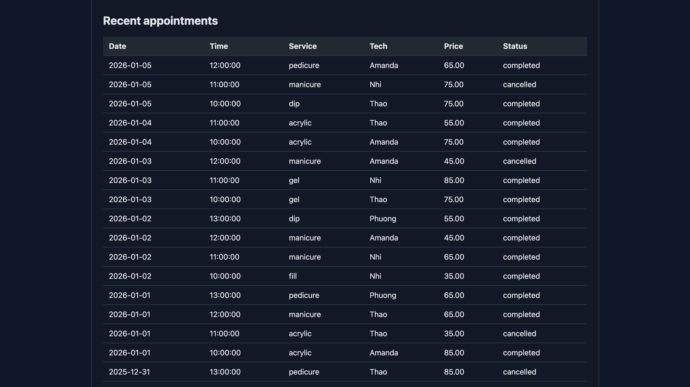

SalonSync – Nail Salon Analytics Dashboard

SalonSync is a full-stack analytics dashboard for a nail salon, designed to visualize appointment patterns, revenue, technician workload, peak hours, and optimization for nail salon scheduling. 
It demonstrates a production-style architecture with a cloud-hosted API, managed database, and a lightweight frontend dashboard.

Tech Stack:

Backend
- Python
- FastAPI
- PostgreSQL
- psycopg2
- Docker
- Google Cloud Run
- Google Cloud SQL (Postgres)

Frontend
- HTML / CSS / JavaScript
- Chart.js

Data and Analytics:
- SQL (joins, aggregation, grouping)
- R (ggplot2, dplyr)

Features
- View recent appointments
- Revenue and service popularity analytics
- Individualized technician workload analysis
- Cloud-hosted API with managed database
- Dockerized backend for reproducible deployments

Architecture Overview:
Frontend (static HTML/JS)
        ↓ fetch()
FastAPI API (Cloud Run)
        ↓
PostgreSQL (Cloud SQL)

Running Locally (No Docker)

Backend
cd backend
python -m venv venv
source venv/bin/activate
pip install -r requirements.txt

export DB_HOST=localhost
export DB_NAME=nails
export DB_USER=postgres
export DB_PASSWORD=postgres

uvicorn main:app --reload

API will run at:
http://localhost:8000

Frontend
cd frontend
npx serve

Running with Docker
cd docker
docker compose up --build

This starts:
- PostgreSQL
- FastAPI backend

Cloud Deployment

- Backend API deployed to Google Cloud Run
- Database hosted on Google Cloud SQL
- Secure Cloud Run → Cloud SQL connection via socket

Example API endpoints:
/health
/appointments
/stats
/stats/revenue_by_day
/stats/service_popularity

Screenshots:

  

R Analytics Examples
Revenue by day and service popularity plots were generated using R:
library(ggplot2)
library(dplyr)

appointments <- read.csv("../data/appointments.csv")

revenue_by_day <- appointments %>%
  filter(status == "completed") %>%
  mutate(total = price + ifelse(is.na(tip), 0, tip)) %>%
  group_by(date) %>%
  summarise(total_revenue = sum(total))

ggplot(revenue_by_day, aes(x = as.Date(date), y = total_revenue)) +
  geom_col()

(Insert R plot screenshots here)
What This Project Demonstrates
- REST API design with FastAPI
- SQL analytics and schema design
- Dockerized backend services
- Cloud deployment and managed databases
- End-to-end data flow from database → API → dashboard